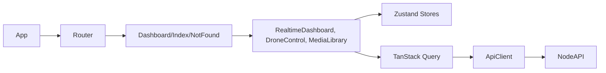
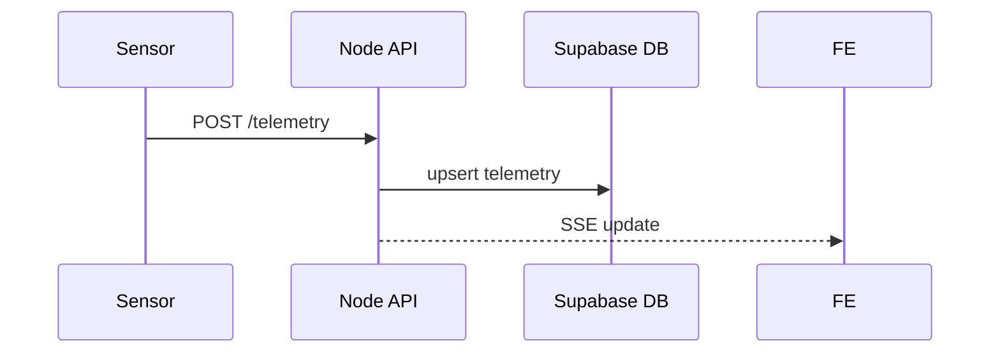
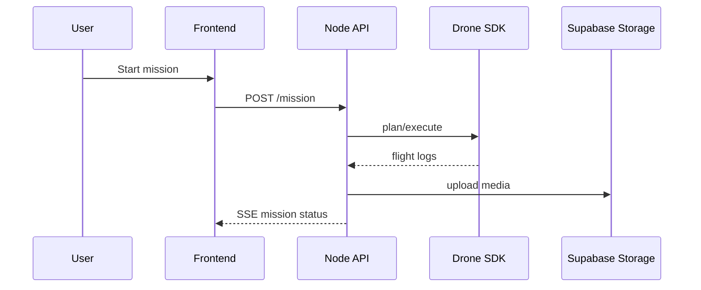
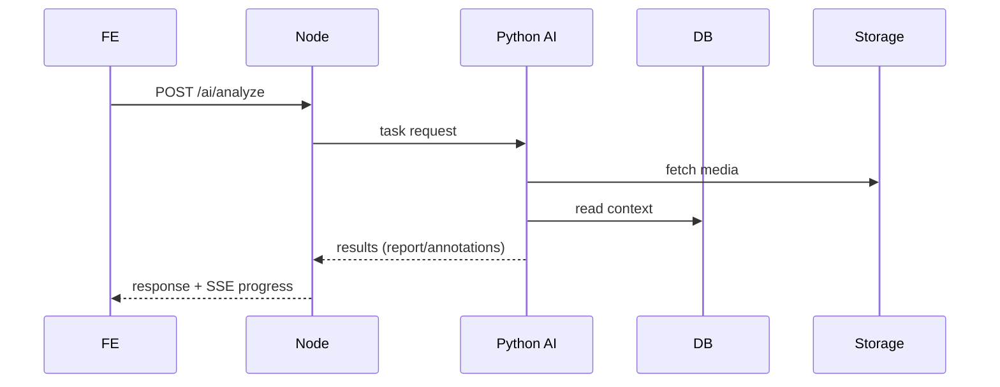
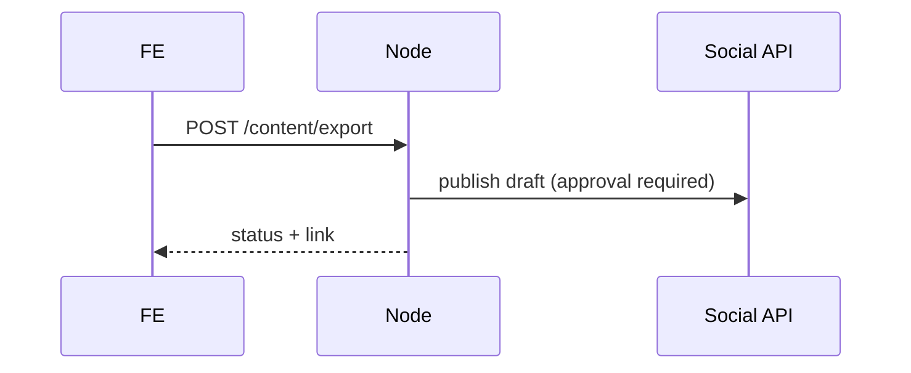

# Architecture

## Context Diagram
```mermaid
flowchart LR
  User[Owner/Worker]-->FE[React+Vite Dashboard]
  FE<-->BE[Node API / SSE]
  FE<-->Supabase[(Supabase Auth/DB/Storage)]
  BE<-->Drone[Drone SDK/API]
  BE<-->AI[Python AI Services (Fly.io)]
  AI<-->Supabase
  Drone-->Media[Media Uploads]
  subgraph Edge
    Drone
  end
```

## Containers
```mermaid
flowchart TB
  subgraph Frontend (Vercel)
    FE[React+TS+Tailwind+shadcn]
  end
  subgraph Backend (Fly.io)
    NodeAPI[Express API + SSE]
    PyAI[AI Manager + Agents]
  end
  subgraph Supabase (Cloud)
    Auth[(Auth)]
    DB[(Postgres)]
    Storage[(Storage)]
  end
  subgraph Farm Edge
    DroneSDK[Drone SDK]
    Sensors[Sensor Gateway]
  end
  FE<-->NodeAPI
  FE<-->Auth
  NodeAPI<-->DroneSDK
  NodeAPI<-->Sensors
  NodeAPI<-->DB
  PyAI<-->DB
  PyAI<-->Storage
```

## Components (Frontend)


## Key Sequences
- Sensor ingest


- Drone flight & media upload


- AI analysis


- Content export


## Data Model (high-level)
- sensors: id, type, location, reading, unit, recorded_at
- flights: id, plan, started_at, completed_at, status, notes
- media: id, flight_id, path, type, captured_at, annotations
- analytics: id, source_id, kind, payload(jsonb), created_at

## Auth
- Roles: owner (admin), worker (limited). Private dashboard only (Supabase Auth).

## Flows
- Sensor ingest; Drone flight & media upload; AI analysis; Content export (see sequences).

## Non-functional
- Latency: manual drone control path avoids blocking UI; SSE for updates; edge proximity for control.
- Cost: OSS-first; LLM usage capped; cache results; ≤ $2k/year.
- Observability: structured logs + Sentry + minimal OTel traces.
- Compliance-ready: modular RLS/GDPR toggles without refactors.
